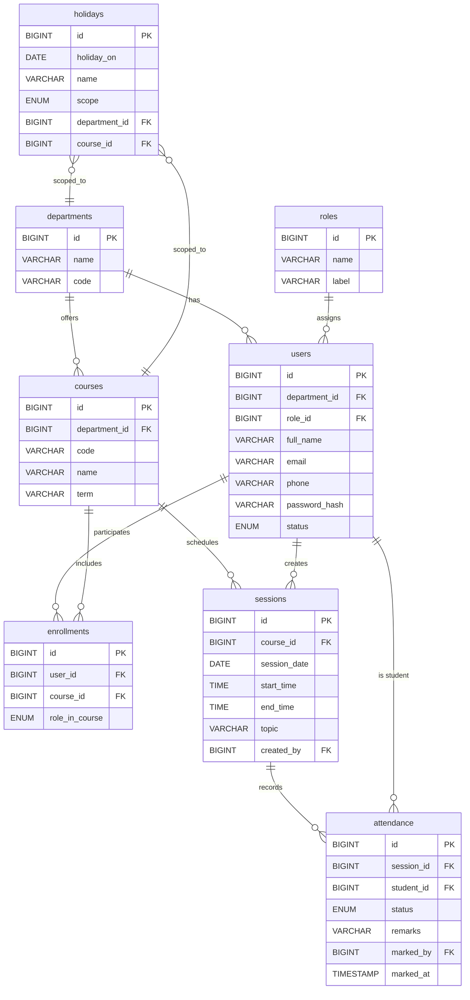

# 📘 Attendance Management System — Project Documentation

> This repository currently contains an Eclipse workspace dump rather than a clean, standalone app. To make it easy to understand, run, and extend, this README provides a **complete, implementation-ready plan** including the **ER diagram, class diagram, database schema, and suggested project structure**. You can adopt this as-is and progressively align your codebase to it.

---

## 🔍 High-Level Overview

A web-based system to manage attendance for students/employees. Key personas:
- **Admin** — manages users, departments, courses/batches, and system settings.
- **Faculty/Manager** — creates sessions and marks attendance.
- **Student/Employee** — views personal attendance.

Core flows:
1. **User & Course Setup →** Add departments, users, and assign them to courses/batches.
2. **Session Scheduling →** Faculty creates daily/class sessions.
3. **Attendance Marking →** Mark Present/Late/Absent with remarks.
4. **Reporting →** Filter by user, course, date range; export CSV/PDF.

---

## 🧱 Suggested Project Structure (Maven)

```
attendance-management-system/
├─ src/
│  ├─ main/
│  │  ├─ java/com/example/ams/
│  │  │  ├─ config/
│  │  │  ├─ controller/        # Servlets/REST controllers
│  │  │  ├─ dao/               # Data access
│  │  │  ├─ model/             # Entities/DTOs
│  │  │  └─ service/           # Business logic
│  │  ├─ resources/
│  │  │  └─ application.properties
│  │  └─ webapp/
│  │     ├─ WEB-INF/web.xml
│  │     ├─ pages/             # JSP or Thymeleaf templates
│  │     └─ assets/            # CSS/JS/Images
│  └─ test/java/...
├─ database/
│  ├─ schema.sql
│  └─ seed.sql
├─ pom.xml
└─ README.md
```

---

## 🗄️ Database Schema (MySQL)

> Covers the minimal core required for a production-grade AMS. Includes users/roles, departments, courses, enrollments, sessions, and attendance.

```sql
-- database/schema.sql

-- 1) Reference tables
CREATE TABLE departments (
  id           BIGINT PRIMARY KEY AUTO_INCREMENT,
  name         VARCHAR(100) UNIQUE NOT NULL,
  code         VARCHAR(20) UNIQUE,
  created_at   TIMESTAMP DEFAULT CURRENT_TIMESTAMP,
  updated_at   TIMESTAMP NULL DEFAULT NULL ON UPDATE CURRENT_TIMESTAMP
);

CREATE TABLE roles (
  id        BIGINT PRIMARY KEY AUTO_INCREMENT,
  name      VARCHAR(50) UNIQUE NOT NULL,     -- ADMIN, FACULTY, STUDENT
  label     VARCHAR(80) NOT NULL
);

-- 2) Users
CREATE TABLE users (
  id              BIGINT PRIMARY KEY AUTO_INCREMENT,
  department_id   BIGINT NULL,
  role_id         BIGINT NOT NULL,
  full_name       VARCHAR(120) NOT NULL,
  email           VARCHAR(160) UNIQUE NOT NULL,
  phone           VARCHAR(20),
  password_hash   VARCHAR(255) NOT NULL,
  status          ENUM('ACTIVE','INACTIVE','SUSPENDED') DEFAULT 'ACTIVE',
  created_at      TIMESTAMP DEFAULT CURRENT_TIMESTAMP,
  updated_at      TIMESTAMP NULL DEFAULT NULL ON UPDATE CURRENT_TIMESTAMP,
  CONSTRAINT fk_users_department  FOREIGN KEY (department_id) REFERENCES departments(id),
  CONSTRAINT fk_users_role        FOREIGN KEY (role_id)       REFERENCES roles(id)
);

-- 3) Courses/Batches
CREATE TABLE courses (
  id            BIGINT PRIMARY KEY AUTO_INCREMENT,
  department_id BIGINT NOT NULL,
  code          VARCHAR(30) UNIQUE NOT NULL,     -- e.g., CS101, BATCH-A
  name          VARCHAR(120) NOT NULL,
  term          VARCHAR(60),                     -- e.g., 2025-Spring
  created_at    TIMESTAMP DEFAULT CURRENT_TIMESTAMP,
  updated_at    TIMESTAMP NULL DEFAULT NULL ON UPDATE CURRENT_TIMESTAMP,
  CONSTRAINT fk_courses_department FOREIGN KEY (department_id) REFERENCES departments(id)
);

-- 4) Enrollment (many-to-many: users ↔ courses)
CREATE TABLE enrollments (
  id         BIGINT PRIMARY KEY AUTO_INCREMENT,
  user_id    BIGINT NOT NULL,
  course_id  BIGINT NOT NULL,
  role_in_course ENUM('STUDENT','FACULTY') NOT NULL,
  UNIQUE KEY uq_enrollment (user_id, course_id, role_in_course),
  CONSTRAINT fk_enroll_user   FOREIGN KEY (user_id)   REFERENCES users(id),
  CONSTRAINT fk_enroll_course FOREIGN KEY (course_id) REFERENCES courses(id)
);

-- 5) Sessions (a specific meeting of a course on date/time)
CREATE TABLE sessions (
  id           BIGINT PRIMARY KEY AUTO_INCREMENT,
  course_id    BIGINT NOT NULL,
  session_date DATE NOT NULL,
  start_time   TIME NOT NULL,
  end_time     TIME NOT NULL,
  topic        VARCHAR(200),
  created_by   BIGINT NOT NULL,                   -- a faculty user
  created_at   TIMESTAMP DEFAULT CURRENT_TIMESTAMP,
  CONSTRAINT fk_sessions_course  FOREIGN KEY (course_id)  REFERENCES courses(id),
  CONSTRAINT fk_sessions_creator FOREIGN KEY (created_by) REFERENCES users(id)
);

-- 6) Attendance (one row per student per session)
CREATE TABLE attendance (
  id            BIGINT PRIMARY KEY AUTO_INCREMENT,
  session_id    BIGINT NOT NULL,
  student_id    BIGINT NOT NULL,
  status        ENUM('PRESENT','ABSENT','LATE','EXCUSED') NOT NULL,
  remarks       VARCHAR(255),
  marked_by     BIGINT NOT NULL, -- faculty who marked
  marked_at     TIMESTAMP DEFAULT CURRENT_TIMESTAMP,
  UNIQUE KEY uq_attendance (session_id, student_id),
  CONSTRAINT fk_att_session  FOREIGN KEY (session_id) REFERENCES sessions(id),
  CONSTRAINT fk_att_student  FOREIGN KEY (student_id) REFERENCES users(id),
  CONSTRAINT fk_att_marker   FOREIGN KEY (marked_by)  REFERENCES users(id)
);

-- 7) Optional: holidays & leaves
CREATE TABLE holidays (
  id          BIGINT PRIMARY KEY AUTO_INCREMENT,
  holiday_on  DATE NOT NULL,
  name        VARCHAR(120) NOT NULL,
  scope       ENUM('GLOBAL','DEPARTMENT','COURSE') DEFAULT 'GLOBAL',
  department_id BIGINT NULL,
  course_id     BIGINT NULL,
  CONSTRAINT fk_holiday_department FOREIGN KEY (department_id) REFERENCES departments(id),
  CONSTRAINT fk_holiday_course     FOREIGN KEY (course_id)     REFERENCES courses(id)
);
```

### Seed Data

```sql
-- database/seed.sql
INSERT INTO roles (name, label) VALUES ('ADMIN','Administrator'), ('FACULTY','Faculty'), ('STUDENT','Student');

INSERT INTO departments (name, code) VALUES ('Computer Science','CSE'), ('Human Resources','HR');

INSERT INTO users (department_id, role_id, full_name, email, phone, password_hash)
VALUES
  (1, 1, 'System Admin', 'admin@example.com', '9999999999', '$2a$10$replace_with_bcrypt'),
  (1, 2, 'Dr. Alice Faculty', 'alice@example.com', '9999999998', '$2a$10$replace_with_bcrypt'),
  (1, 3, 'Bob Student', 'bob@example.com', '9999999997', '$2a$10$replace_with_bcrypt');

INSERT INTO courses (department_id, code, name, term)
VALUES (1, 'CS101', 'Intro to CS', '2025-Spring');

INSERT INTO enrollments (user_id, course_id, role_in_course) VALUES
  (2, 1, 'FACULTY'),
  (3, 1, 'STUDENT');

INSERT INTO sessions (course_id, session_date, start_time, end_time, topic, created_by)
VALUES (1, '2025-01-10', '09:00:00', '10:00:00', 'Introduction', 2);
```

---

## 🧬 ER Diagram (Mermaid)



---

## 🧩 Class Diagram (Mermaid)

```mermaid
classDiagram
  class Department {
    +Long id
    +String name
    +String code
    +Instant createdAt
    +Instant updatedAt
  }

  class Role {
    +Long id
    +String name  // ADMIN, FACULTY, STUDENT
    +String label
  }

  class User {
    +Long id
    +Department department
    +Role role
    +String fullName
    +String email
    +String phone
    +String passwordHash
    +Status status
  }

  class Course {
    +Long id
    +Department department
    +String code
    +String name
    +String term
  }

  class Enrollment {
    +Long id
    +User user
    +Course course
    +CourseRole roleInCourse
  }

  class Session {
    +Long id
    +Course course
    +LocalDate sessionDate
    +LocalTime startTime
    +LocalTime endTime
    +String topic
    +User createdBy
  }

  class Attendance {
    +Long id
    +Session session
    +User student
    +AttendanceStatus status
    +String remarks
    +User markedBy
    +Instant markedAt
  }

  class Holiday {
    +Long id
    +LocalDate holidayOn
    +String name
    +Scope scope
    +Department department
    +Course course
  }

  enum Status { ACTIVE INACTIVE SUSPENDED }
  enum CourseRole { STUDENT FACULTY }
  enum AttendanceStatus { PRESENT ABSENT LATE EXCUSED }
  enum Scope { GLOBAL DEPARTMENT COURSE }

  Department "1" --> "0..*" User : has
  Role "1" --> "0..*" User : assigns
  Department "1" --> "0..*" Course : offers
  User "1" --> "0..*" Enrollment : participates
  Course "1" --> "0..*" Enrollment : includes
  Course "1" --> "0..*" Session : schedules
  Session "1" --> "0..*" Attendance : records
  User "1" --> "0..*" Attendance : student
  User "1" --> "0..*" Session : creates
  Holiday "0..*" --> "1" Department : scoped_to
  Holiday "0..*" --> "1" Course : scoped_to
```

---

## 🔐 Authentication Notes

- Use **BCrypt** for password hashing.
- Store only `password_hash` (never plaintext).
- Add account states: `ACTIVE`, `INACTIVE`, `SUSPENDED`.
- For web apps, use session-based auth or JWT for APIs.

---

## 🧪 Sample Queries

```sql
-- Attendance percentage for a student in a course
SELECT u.full_name,
       c.code,
       SUM(a.status='PRESENT') / COUNT(*) * 100 AS attendance_pct
FROM attendance a
JOIN sessions s   ON s.id = a.session_id
JOIN courses c    ON c.id = s.course_id
JOIN users u      ON u.id = a.student_id
WHERE a.student_id = :studentId
  AND c.id = :courseId
GROUP BY u.full_name, c.code;

-- Daily summary per course
SELECT c.code, s.session_date,
       SUM(a.status='PRESENT') AS present_count,
       SUM(a.status='ABSENT')  AS absent_count,
       SUM(a.status='LATE')    AS late_count
FROM sessions s
LEFT JOIN attendance a ON a.session_id = s.id
JOIN courses c ON c.id = s.course_id
WHERE c.id = :courseId
GROUP BY c.code, s.session_date
ORDER BY s.session_date DESC;
```

---

## 🧰 API Endpoints (suggested, REST)

```
POST   /api/auth/login
GET    /api/users/me

GET    /api/departments
POST   /api/departments

GET    /api/courses
POST   /api/courses
GET    /api/courses/{id}

POST   /api/enrollments
GET    /api/courses/{id}/enrollments

POST   /api/courses/{id}/sessions
GET    /api/courses/{id}/sessions?from=&to=

POST   /api/sessions/{id}/attendance
GET    /api/sessions/{id}/attendance
GET    /api/students/{id}/attendance?courseId=&from=&to=

GET    /api/reports/attendance?courseId=&from=&to=
```

---

## 🧭 How to Align This With Your Workspace

1. Create a new Maven project using the structure above.
2. Move relevant code from your `Practice/` folder (if any reusable utilities) into appropriate packages.
3. Add `database/schema.sql` and `seed.sql` to your repo and apply them on a fresh MySQL instance.
4. Start by implementing the **model layer** in `com.example.ams.model` to match the class diagram.
5. Then implement DAOs/Repositories and Services following the ER model.
6. Finally, add controllers (Servlet/JAX-RS/Spring MVC) and JSP pages or a JS front-end.

---

## 📄 License

